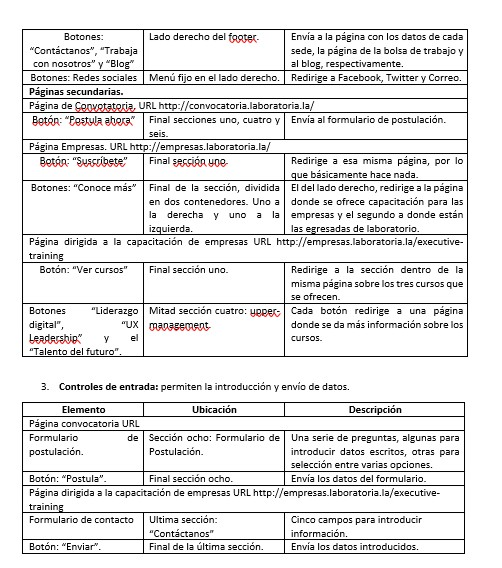
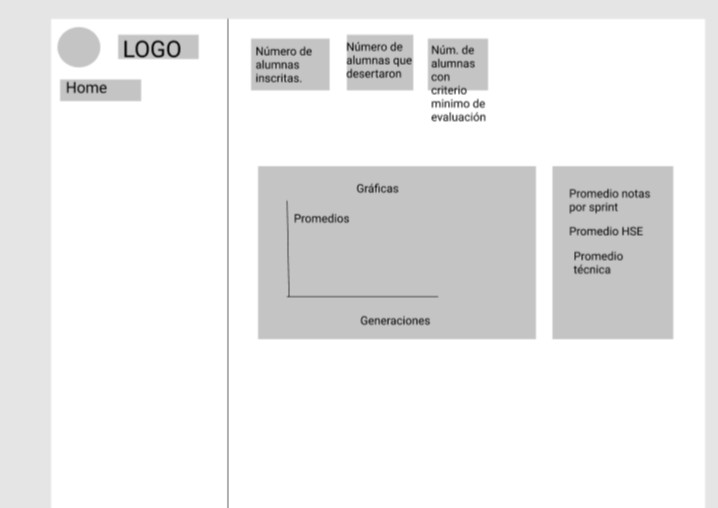

ANALISIS UI LABORATORIA

ANALISIS UX LABORATORIA

1.	¿Cuál es el objetivo de la página de Laboratoria?
La página tiene dos objetivos. El primero y principal es lograr que las mujeres que accedan a la página postulen al programa. El segundo, lograr que las empresas se inscriban, ya sea para tomar los cursos o para contratar a las egresadas. 
2.	¿Qué acciones se realizan dentro de la página?
La página de Laboratoria tiene contenidos informativos sobre los programas que ofrece, así como las secciones relativas a la incorporación a los programas. Los formularios para las postulantes y los correspondientes a el contacto con las empresas interesadas. 
3.	¿Dónde será vista la página web?
La página web será vista desde dispositivos móviles y computadoras, frecuentemente redirigido desde la página de Facebook [tomando en consideración lo comentado por mis compañeras].
4.	¿Por qué están utilizando la página?
Según lo comentado por mis compañeras de clase, lo que sobresale es el interés por mejorar las condiciones económicas, a través de una capacitación profesional que permita obtener una mejor posición laboral. 
5.	¿Quién va a utilizarla?
Mayoritariamente mujeres que estén interesadas en capacitarse profesionalmente, con una edad entre los 18 y 15 años, que no hayan tenido acceso a una educación de calidad. 

ANALISIS DE NAVEGACION GitHub

Navegación principal:
Está contenida en la barra de navegación en el header. Ésta, es fija. Se refiere al ícono de GitHub que redirige a la página principal.

Navegaciones locales:
Posteriormente en la barra de navegación tenemos los botones para navegar en páginas locales. Features, redirige a la página con información sobre cómo trabajan los desarrolladores; Business, página para trabajar colectivamente; Marketplace, página con herramientas para implementar el flujo de trabajo y Pricing, página con los costos de las membresías. También incluye una barra de búsqueda, donde se puede iniciar un tipo de navegación donde indicamos elementos específicos de interés. Dado que esta selección puede ser definida por el usuario, es un tipo de navegación filtrada. Finalmente, están los botones de Sign in y Sign up, que nos redirigen a sus páginas con sus respectivos formularios.  
Podemos encontrar navegación en línea, es decir con links de referencia colocados a ciertas palabras para dar más información sobre ellas. Por ejemplo, tenemos “open source” y “business” en la primera sección; los términos de servicio y la política de privacidad en la sección del formulario. En la siguiente sección, “Learn about code review”, “Learn about project management” y “Learn about integrations” también corresponden a este tipo de navegación. 
Al final de la página tenemos la navegación en el pie, donde Features, Platform, Community, Company, Resources, tienen una lista de links asociados a temas de interés de cada tema. 

SKETCH

